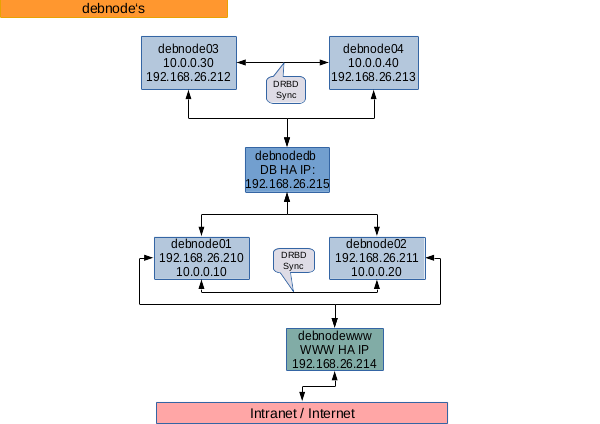

cluster-queue - core
============================================================

DE | [EN](README_EN.md)

<!-- doctoc --title 'Inhalt' README.md -->
<!-- START doctoc generated TOC please keep comment here to allow auto update -->
<!-- DON'T EDIT THIS SECTION, INSTEAD RE-RUN doctoc TO UPDATE -->
Inhalt

- [cluster-queue - core - Projekt](#cluster-queue---core---projekt)
  - [Ausgangssituation](#ausgangssituation)
    - [Basis zum Ausprobieren](#basis-zum-ausprobieren)
  - [Installation](#installation)
    - [Anforderungen](#anforderungen)
  - [Beschreibung](#beschreibung)
  - [Benutzung von `php-cluster-queue`](#benutzung-von-php-cluster-queue)
    - [Parameter Beschreibung](#parameter-beschreibung)
    - [Konfiguration](#konfiguration)
      - [Die `default` und nodes `configs` Konfiguration.](#die-default-und-nodes-configs-konfiguration)
  - [Beispiel HA Cluster [ Web | DB ] Server Infrastruktur](#beispiel-ha-cluster--web--db--server-infrastruktur)

<!-- END doctoc generated TOC please keep comment here to allow auto update -->

cluster-queue - core - Projekt
============================================================

Einrichtung einer Konfiguration um einen oder mehrere server oder server cluster
einrichten zu können. Z.B HA Cluster mit DRBD/ Heatbeat für DB und WWW Server
konfigurieren.

`core` - Projekt

Das [cluster-queue/dummy](http://github.com/cluster-queue/dummy) Projekt ist für die
reine Benutzung eines eigenen Projektes ausgelegt das diese Quellen nutz.
Die Dokumentation liegt je nach Version, nach der Installation des `dummy` Projektes bei.

Ausgangssituation
------------------------------------------------------------

HA Cluster mit DRBD/ Heatbeat für DB und WWW Server einrichten/ installieren.

Installationreihenfolgen und Abhängigkeiten über einen Server hinweg bei der
Konfiguration.

Mehr als zwei Server nicht automatisiert zu installieren bzw. zu konfigurieren
dauert oft genau so lange wie ein mal konfiguriert und dann auf seine Plattformen aus zu
rollen was dann für neue Server automatisiert übertragbar ist.

Sicherlich kenne ich das ein oder andere Tool vielleicht auch nicht. Auch über
docker wurde nachgedacht, aber die Individualisierung und Anpassbarkeit der
Server steht nach wie vor im Vordergrund.

Offen ist noch der Blick Richtung
- [FAI](https://fai-project.org/cluster/) und
- [Ansible](http://ansible.com)
um **High End** Massen- Installationen/ Konfigurationen eine Antwort zu geben.

Mit diesem Programm soll der Konfigurations Prozess vereinfacht/ automatisiert werden
können.

- Lokale Konfigurationen für alle Server (fest oder generiert) zu Servern überspielen
- Shell Kommandos/ Services einrichten verwalten
- Über mehrere Server hinweg Reihenfolgen bei der Ausführung beachten.

Ggf. folgen noch Konfigurationen mit denen der Installationsprozess auch mit
diesem Programm erledigt werden kann.

### Basis zum Ausprobieren

+ [Virtual Box](http://www.virtualbox.org):

  - 4 x Debian 10 VM's
  - Mit je einer weiteren Daten Festplatte gleicher Grösse für DRBD
  - 2 Netzwerk Karten (1x (eg.via dhcp) internet fähig, 1x interne Kommunikation)
  - Minimal installation, nur SSH wählen; VM 4 x Klonen, je hostnamen ändern,
    reboot
  - drbd, heartbeat auf allen Nodes installieren

+ DB Gruppe 2 x mit MariaDB.
+ WWW Gruppe 2 x nginx, php, php-fpm...
+ Installationsreihenfolgen **unbedingt** synkron halten.
+ 'root' und 'linux' User mit ssh pub keys erreichbar machen.

Installation
------------------------------------------------------------

Um die hier befindlichen Programme nutzen zu können müssen Abhängigkeiten
installiert werden.

    cd ./

    php7.3 /path/to/composer.phar install

    # Falls nicht ausführbar:
    chmod +x php-cluster-queue

    # Starten:
    # ./php-cluster-queue --[mehr siehe unten]

Composer? "A Dependency Manager for PHP" [Homepage](https://getcomposer.org),
[Download](https://getcomposer.org/download).

### Anforderungen

Anforderungen an dieses Programm:

    php >= 7.3, 7.4, 8.0 ...
    php-cli
    ssh
    scp
    bash | zsh

- Wichtig: Bitte sicherstellen das `php -v` min. php7.3 liefert.
  Ansonnsten die Shebang von `php-cluster-queue` anpassen oder entsprechende Pakete
  installieren.

- Wo läuft 'php-cluster-queue'?
  Auf jedem Betriebssystem/ OS wo `php` als auch ggf. Shell scripte
  (`sh`/ `bash`) in der Console ausgeführt werden können als auch `scp` und `ssh`.

- Vorzugweise ein Unix/Linux basierendes OS. Für andere Betriebssysteme liegen
  keine Quellen bei.

- Ziel Systeme: Linux (Z.B. in einer 'Virtual Box', 'VMWare' Umgebung, Echte
  Rechner). U.a. getestet unter debian (debian 10, Buster) in 'Virtual Box'.

Beschreibung
------------------------------------------------------------

Das Programm kann auf Basis von "Node"/ Server Konfigurations- Dateien
Konfigurationen zu bestimmten Nodes/Servern kopieren, aus Templates individuelle
Konfigurationen erstellen und dann zum jeweiligen oder zu allen Nodes/Servern
Kopieren als auch individuelle Kommandos ausführen. Aktions- Reihenfolgen sind
gruppiert bestimmbar weshalb dieses Projekt enstanden ist.

Ausgangspunkt sind folgene Basis- Aktionen:

+ `deploy` Zum Remote Node/ Server Kopieren
+ `archive` Vom Remote Node/ Server Kopieren (Archivierung z.B. nach
  `archive/NODENAME/`)
+ `actions` Shell Kommandos die auf einem bestimmten oder allen Remote Node/s
  oder auch lokal ausgeführt werden sollen.

Konfigurations Datei (und Aktion): `defaults` gilt für alle Nodes
(`src/config/nodesconfigs_CONFIGNAME_default.php`).

Die Node Konfigurations Datei (und Aktion): `configs`
(`src/config/nodesconfigs_CONFIGNAME.php`) für individuelle Schritte pro Node
Konfiguration.

Die Ausführungsreihenfolge ist innerhalb der Node/s Konfiguration bestimmbar.

Z.B:

    # Variante 1:
    copy skel/generic/etc/mysql/someconfig root@remoteA:/etc/mysql/conf.d/someconfig
    copy skel/generic/etc/mysql/someconfig root@remoteB:/etc/mysql/conf.d/someconfig
    remoteB: restart mysql
    remoteA: restart mysql

    # Variante 2:
    copy skel/generic/etc/mysql/someconfig root@remoteA:/etc/mysql/conf.d/someconfig
    remoteA: restart mysql
    copy skel/generic/etc/mysql/someconfig root@remoteB:/etc/mysql/conf.d/someconfig
    remoteB: restart mysql

Natürlich müssen die echten Kommandos für das entsprechende Ziel- Betriebssystem
in den Konfigurationen hinterlegt werden.

Benutzung von `php-cluster-queue`
------------------------------------------------------------

Beispiel Aufruf:

    ./php-cluster-queue \
        --config=debnode --action=defaults --execute --confirm # --no-debug
                    |               |           |       |          |
                    |               |           |       |          +
                    |               |           |       |          Debug/Reporting auf das
                    |               |           |       |          Minimum reduzieren.
                    |               |           |       |
                    |               |           |       + Jedes Kommando bestätigen.
                    |               |           |
                    |               |           + Führe Kommandos wirklich aus.
                    |               |
                    |               + Welche Aktion soll ausgeführt werden?
                                      create|build|defaults|configs|deploy|archive|actions
                    |
                    + Welche Konfigurations Kombination soll geladen werden?
                      `nodeconfigs_**NAME**.php` und `nodeconfigs_**NAME**_default.php`
                      Gruppen Name für alle Nodes. In diesem Beispiel `debnode` für die
                      4 Test Nodes/ Server:
                        - Web Nodes: `debnode01` `debnode02`
                        - DB Nodes: `debnode03`,`debnode04`,

Verwendete Beispiel- Konfigurationen:

+ Node/s Konfigurationen:

  `src/config/nodeconfigs_debnode.php`

+ Konfigurationen die für alle Nodes/ Server in `debnode` gelten. Aktion `defaults`:

  `src/config/nodeconfigs_debnode_default.php`

### Parameter Beschreibung

    --config=[ NAME ]

        Es müssen immer zwei Konfigurations Datei-Paare existieren:
        Individuell: `nodeconfigs_NAME.php` und
        Alle Nodes : `nodeconfigs_NAME_default.php`

    --action=[ defaults|configs|create|build|deploy|archive|actions ]

        `defaults`  : `deploy`, `archive` oder `actions` auf **allen** Nodes anwenden.

        `create`|`build`: Templates aus `skel/` nehmen, rendern (Suchen/Ersetzen anwenden)
                          und nach `build/` kopieren. Für eine spätere Übertragung (Sofern
                          in der Node Konfiguration angegeben).

        ---> custom (Abfall Produkt; Kann, muss aber nicht Sinnvoll sein) -->--

        `deploy` : Node und default Konfiguration laden aber nur alle `deploy` Aktionen anwenden.

        `archive`: Node und default Konfiguration laden aber nur alle `archive` Aktionen anwenden.

        `actions`: Node und default Konfiguration laden aber nur alle `actions` Aktionen anwenden.

        --<--

    --execute

        Flag um das echt Ausführen zu erlauben.
        Standartmässig wird alles nur Protokolliert (`log/`) als auch nach `stdout`
        ausgegeben.

    --confirm

        Flag um vor jeder aktion (scp|ssh) eine Bestätigung ein zu holen.

    --no-debug

        Redefreudingkeit auf das Minimum reduzieren.
        In der `actions` Konfiguration können auch Kommentare hinterlegt werden um
        zusammenspiele bei der Ausfürung von Aktionen mit aus zu geben. Sehr Sinnvoll in
        Verbindung mit `--confirm`. Wem das lästig ist kann es aus machen.
        Mit Raute/Hashtag Prefix können in der `actions` Konfiguration Kommentare
        hinterlegt werden welche grundsätzlich vor Ausführung gefiltert aber ausgegeben
        werden können.

### Konfiguration

#### Die `default` und nodes `configs` Konfiguration.

Die `nodeconfigs_NAME_default.php` Konfiguration gilt für jeden Node welcher in der Node
Konfiguration (NAME, `nodeconfigs_NAME.php`) angegeben ist.

Hier werden nur Aktionen konfiguriert. Die Konfigurations- Struktur ist mit der Node
Konfiguration (Bereich `actions`) vergleichbar bzw. identisch.

Es werden verschiedene Job Konfigurationen erstellt die verschiedene Aufgaben übernehmen
können. Z.B (type): `deploy`, `archive`, `execute`.

Jede Job Konfiguration beinhaltet im Aktions- Code z.B `'debnode01:defaultdeploy'` den
prefix des aktuellen Hostnamen/Node um den es gerade geht: 'prefix:individualcode'. Bei
der `default` Konfiguration wird `NODECURRENTPUB` dann ersetzt um auch ggf. Abhängigkeiten
in der Ausführungsreihenfolge ändern zu können.

`deploy`: Quell- Dateien müssen im Ordner `skel/` hinterlegt sein.

`archive`: Zieldatein sollten in einen zentralen Ordner gehen. Z.b. `archive/NODECURRENTPUB/`

**Beispiel** `deploy`:

Standard Aktions- Konfiguration, Typ:deploy. All diese Werte (je Typ) sollten existieren,
können im `value` allerdings leer bleiben. Leere Job Konfigurationen können helfen
Aktionsreihenfolgen besser zu definieren.

    return array(
        // Aktionen die für alle Nodes gelten
        'actions' => array(
            // Job 1:
            // NODECURRENTPUB wird ersetzt werden.
            'NODECURRENTPUB:defaultdeploy' => array(
                'type' => 'deploy',
                'value' => array(
                    // from local 'skel/' => to remote
                    '/testfile_NODECURRENTPUB.txt' => '/tmp/testfile.txt',
                ),

                // Wann soll dieser Job greifen:
                'posway' => 'after',

                // An welcher Stelle soll dieser Job eingereiht werden.
                // z.B. 'debnode03:defaultdeploy' -> Nach debnode03:defaultdoploy ausführen.
                // ZZt: Reihenfolge: Job 1 = Pos:1/Node
                'poskey' => null,
            ),
    ...

**Sonderfall** `deploy`:

In `skel/` können sich auch Templates befinden die bei Programmstart gewandelt (siehe
`'replace'` in der Node Konfiguration) und nach `build/` kopiert werden.

Diese Dateien können wie folgt in den deploy Prozess mit einbezogen werden:

    // Job 2
    'debnode01:deploybuilds' => array(
        'type' => 'deploy',                     Aktion: deploy
        'value' => array(
            'files' => true                     Soll als eigener Job konfiguriert werden.
        ),
    ...

`execute`: Es wird eine Liste von Kommandos hinterlegt die per default remote mit dem
`root` Benutzer ausgeführt werden.

Muss man allerdings lokal zuvor etwas ausführen oder soll ein anderer Remote- Benutzer
genutzt werden wird im array key das Kommando hinterlegt und als value stehen folgende
Optionen zur Verfügung:

    // Job N excecute
    ...
    'type' => 'execute',
    'value' => array(
        'remote command 1', // ...

        'cmd2' => array(                    Wird zu: ssh username@remote 'cmd2' (remote)
            'type' => 'remote' | 'local'

            // Benutzer der das Kommando Remote ausführen soll.
            // SSH Verbindung sollte zuvor geprüft sein.
            'user' => 'username',
        ),
        // Z.B: 'local': ... da das Komando lokal ausgeführt werden soll!
        'scp a user@remote:/tmp/a' => array('type'=>'local'),
        // versus
        'cp /tmp/a /tmp/b' => array('type'=>'remote'),

Beispiele sind in: 'src/config/nodeconfigs_ **demo | debnode** [ _default ].php' zu finden.

Beispiel HA Cluster [ Web | DB ] Server Infrastruktur
------------------------------------------------------------

HA [ Web | DB ] Server Infrastruktur Install/ Updates/ Maintainance / Docs

Die hier befindlichen Skripte/ Dokumentation helfen ein HA Cluster Server setup fast
vollautomatisch bereit zu stellen. Hinweise zu liefern wie es funktioniert oder
wie aktualisierungen vorgenommen werden können.

Beispiel- Serveraufstellung ([PDF](docs/assets/HA_Netz_debnode.pdf))

In der [Anleitung](https://www.howtoforge.de/anleitung/wie-man-mariadb-high-availability-mit-heartbeat-und-drbd-auf-ubuntu-1604-lts-einrichtet/)
wird Schrittweise erklärt wie man ein HA Setup mit DRBD/ Heatbeat herstellen kann.

Für einen Testcase liegen Konfigurations- Dateien bei (config/**debnode**) wie man zwei
DB und Web Server Ausfallsicher/ Hoch verfügbar (HA) machen kann (z.B lokal zum testen
mittels Virtual Box).

