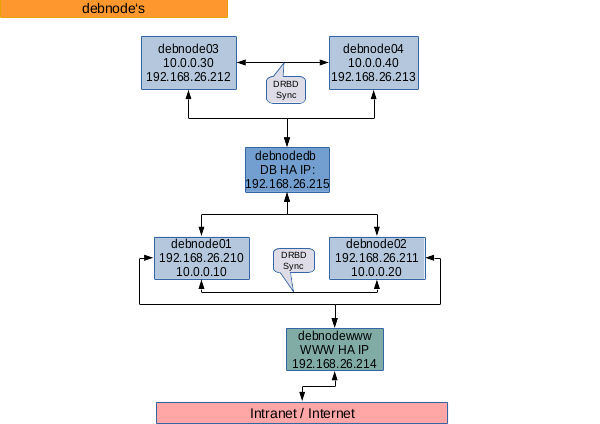

cluster-queue - core
============================================================

EN | [DE](README.md)

<!-- doctoc --title 'Inhalt' README.md -->
<!-- START doctoc generated TOC please keep comment here to allow auto update -->
<!-- DON'T EDIT THIS SECTION, INSTEAD RE-RUN doctoc TO UPDATE -->
Contents

- [cluster-queue - core - Project](#cluster-queue---core---project)
  - [Initial situation](#initial-situation)
    - [Basis for testing](#basis-for-testing)
  - [Installation](#installation)
    - [Requirements](#requirements)
  - [Description](#description)
  - [Using `php-cluster-queue`](#using-php-cluster-queue)
    - [Parameter description](#parameter-description)
    - [Configuration](#configuration)
      - [The `default` and nodes `configs` configuration.](#the-default-and-nodes-configs-configuration)
  - [Example HA Cluster [ Web | DB ] Server Infrastructure](#example-ha-cluster--web--db--server-infrastructure)

<!-- END doctoc generated TOC please keep comment here to allow auto update -->

cluster-queue - core - Project
============================================================

Setup of a configuration around one or more server or server cluster
can be set up. E.g. Configure a HA cluster with DRBD/ Heatbeat for DB and WWW servers.

`core` - Project

The [cluster-queue/dummy](http://github.com/cluster-queue/dummy) project is for the use
of an own project including these sources. The documentation is also included, depending
on the version, after the installation of the `dummy` project.

Initial situation
------------------------------------------------------------

Set up/install HA cluster with DRBD/ Heatbeat for DB and WWW servers.

Installation sequences and dependencies across a server for
configuration.

Not to install or configure more than two servers automatically
often takes as long as once configured and then transferred to its platforms.
which can then be automatically transferred to new servers.

Surely I don't know the one or other tool maybe. Also about
docker was thought about, but the individualization and adaptability of
server is still in the foreground.

Open is still the view direction
- [FAI](https://fai-project.org/cluster/) and
- [Ansible](http://ansible.com)
to answer **High End** mass installations/ configurations.

With this application the configuration process should be simplified / automated. 

- Transfer local configurations to all servers (fixed or generated) to servers
- Manage Shell Commands/ Set up Services
- Observe execution sequences across multiple servers.

Eventually a configurations for the install/ upgrade process will follow which can be
handled also with this application.

### Basis for testing

+ [Virtual Box](http://www.virtualbox.org):

  - 4 x Debian 10 VM's
  - With one additional data disk of the same size for DRBD
  - 2 network cards (1x (eg.via dhcp) internet capable, 1x internal communication)
  - Minimal installation, select SSH only; VM 4 x clones, change hostname for each,
    reboot
  - install drbd, heartbeat on all nodes

+ DB group 2 x with MariaDB.
+ WWW Group 2 x nginx, php, php-fpm...
+ keep installation order synchronized.
+ Make 'root' and 'linux' user accessible with ssh pub keys.

Installation
------------------------------------------------------------

In order to use the programs located here you need to install some dependencies.

    cd ./

    php7.3 /path/to/composer.phar install

    # If not executable:
    chmod +x php-cluster-queue

    # Start:
    # ./php-cluster-queue --[more see below]

Composer? "A Dependency Manager for PHP" [Homepage](https://getcomposer.org),
[Download](https://getcomposer.org/download).

### Requirements

Requirements for this program:

    php >= 7.3, 7.4, 8.0 ...
    php-cli
    ssh
    scp
    bash | zsh | sh (ash|dash)

- Important: Please make sure that `php -v` delivers min. php7.3.
  If you want have a different version, please change the shebang of `php-cluster-queue`
  or add appropriate packages.

- Where does 'php-cluster-queue' run?
  On every operating system/ OS where `php` as well as shell scripts
  (`sh`/ `bash`) can be executed in the console as well as `scp` and `ssh`.

- Preferably a Unix/Linux based OS. For other operating systems there are
  no sources in this package.

- Target systems: Linux (e.g. in a 'Virtual Box', 'VMWare' environment, real
  computers). Among others tested under debian (debian 10, Buster) in 'Virtual Box'.

Description
------------------------------------------------------------

The program can be based on "node"/ server configuration files
Copy configurations to specific nodes/servers, create individual configurations
from templates configurations and then to the respective or all nodes/servers
Copy as well as execute individual commands. Action sequences are grouped
determinable why this project was created.

Starting point are the following basic actions:

+ `deploy` Copy to remote node/server
+ 'archive' Copy from remote node/server (archiving e.g. to
  `archive/NODENAME/`)
+ `actions` shell commands that are executed on a specific or all remote node/s
  or to be executed locally.

Configuration file (and action): 'defaults' applies to all nodes
(`src/config/nodesconfigs_CONFIGNAME_default.php`). **Must not exists.**

The node configuration file (and action): `configs`.
(`src/config/nodesconfigs_CONFIGNAME.php`) for individual steps per node
configuration.

The order of execution can be defined within the node/s configuration.

For example:

    # Variant 1:
    copy skel/generic/etc/mysql/someconfig root@remoteA:/etc/mysql/conf.d/someconfig
    copy skel/generic/etc/mysql/someconfig root@remoteB:/etc/mysql/conf.d/someconfig
    remoteB: restart mysql
    remoteA: restart mysql

    # Variante 2:
    copy skel/generic/etc/mysql/someconfig root@remoteA:/etc/mysql/conf.d/someconfig
    remoteA: restart mysql
    copy skel/generic/etc/mysql/someconfig root@remoteB:/etc/mysql/conf.d/someconfig
    remoteB: restart mysql

Of course, the real commands for the corresponding target operating system should be
used for the configurations.

Using `php-cluster-queue`
------------------------------------------------------------

Example call:

    ./php-cluster-queue \
        --config=debnode --action=defaults --execute --confirm # --no-debug
                    |               |           |       |          |
                    |               |           |       |          +
                    |               |           |       |          Reduce debug/ output
                    |               |           |       |          reporting to the minimum
                    |               |           |       |
                    |               |           |       + Confirm each command.
                    |               |           |
                    |               |           + Do execute commands.
                    |               |
                    |               + Which action to use?
                                      create|build|defaults|configs|deploy|archive|actions
                    |
                    + Which config combination shlould be used?
                      `nodeconfigs_**NAME**.php` and `nodeconfigs_**NAME**_default.php`
                      Group name for all nodes. In this case `debnode` for the
                      4 Test Nodes/ Servers:
                        - Web Nodes: `debnode01` `debnode02`
                        - DB Nodes: `debnode03`,`debnode04`,

Used example configurations:

+ Node/s configurations:

  `src/config/nodeconfigs_debnode.php`

+ Configurations for all nodes/ server in `debnode`. Action `defaults`:

  `src/config/nodeconfigs_debnode_default.php`

  Must not exists if you don't have actions for all nodes.

### Parameter description

    --config=[ NAME ]

        There must always be two configuration file pairs:
        Individual: `nodeconfigs_NAME.php` und
        All nodes : `nodeconfigs_NAME_default.php`

    --action=[ defaults|configs|create|build|deploy|archive|actions ]

        `defaults`  : `deploy`, `archive` or `actions` to be executed on **all** nodes.

        `create`|`build`: Templates from `skel/`, rendering (apply search/replace)
                          and copy to `build/`. For a later deployment (If configured
                          in the node configuration).

        ---> custom (Waste product; can, but does not have to be useful) -->--

        `deploy` : Load node and default configuration but apply only `deploy` actions.

        `archive`: Load node and default configuration but apply only `archive` actions.

        `actions`: Load node and default configuration but apply only `actions` actions.

        --<--

    --execute

        Flag for the real execution.
        By default, everything is only logged (`log/`) and to `stdout`.

    --confirm

        Flag to get a confirmation before each action (scp|ssh).

    --no-debug

        Minimize the logger output.
        In `actions` configurations you can also add comments to show hints.
        Very usful together with the use of `--confirm`.
        If you don't like it you can set it (nearly) off.
        With the hashtag (#) prefix you can add `actions` comments which will be
        filtered before a real execution but can to reported to output and everything
        will be logged anyway.

### Configuration

#### The `default` and nodes `configs` configuration.

The `nodeconfigs_NAME_default.php` configuration file is for every node which is
configured in the nodes config `nodeconfigs_NAME.php` file identified by NAME.

Here (`default`) you can add actions only. But they are for each configured node.
The configuration structure is identical with the action configuration of the nodes
config (Section `actions`).

Different job configurations are created that can perform different tasks.
E.g (type): `deploy`, `archive`, `execute`.

Each job configuration contains in the action code the prefix of the current hostname/
node. E.g: 'prefix:individualcode'. 
In the `default` configuration `NODECURRENTPUB` will be replaced with the replacment
value of the current node (when parsing) to also include dependencies in the execution
sequence.

`deploy`: Source files must exist in path `skel/`.

`archive`: Files or paths should be placed in a central folder. E.g: `archive/NODECURRENTPUB/`.

**Example** `deploy` for the `default` (all nodes) config:

Standard action configuration, type:deploy. All these values (per type) should exist,
can remain empty in the 'value'. Empty job configurations can help to improve the action
sequences.

    return array(
        // if default config: For all nodes
        'actions' => array(
            // Job 1:
            // NODECURRENTPUB will be replaced
            'NODECURRENTPUB:defaultdeploy' => array(
                'type' => 'deploy',
                'value' => array(
                    // from local 'skel/' => to remote
                    '/testfile_NODECURRENTPUB.txt' => '/tmp/testfile.txt',
                ),

                // When to use this job:
                'posway' => 'after',

                // At which position should this job be queued.
                // E.g. 'debnode03:defaultdeploy' -> Execute after debnode03:defaultdoploy
                // Current order: Job 1 = Pos:1/per Node
                'poskey' => null,
            ),
    ...

**Special case** `deploy`:

In `skel/` you can also find templates which are converted at program start (see
`'replace'` at the nodes config) and copied to `build/`.

These files can be included in the deploy process as follows:

    // Job 2
    'debnode01:deploybuilds' => array(
        'type' => 'deploy',                     Action type: deploy
        'value' => array(
            'files' => true                     To be configured as a separate job.
        ),
    ...

`execute`: A list of commands is stored which can be executed remotely and by default
with the `root` user.

But if you have to execute something locally before or if you want to use another
remote user, you have to enter the command in the array key. For the array value
the following available options are::

    // Job N excecute
    ...
    'type' => 'execute',
    'value' => array(
        'remote command 1', // ...

        'cmd2' => array(                    Become to: ssh username@remote 'cmd2' (remote)
            'type' => 'remote' | 'local'

            // User for this command.
            // SSH connection for this user should be verified.
            'user' => 'username',
        ),
        // E.g: 'local': ... to call the command locally because it does copy to remote
        'scp a user@remote:/tmp/a' => array('type'=>'local'),
        // versus; Copies at the remote from a to b
        'cp /tmp/a /tmp/b' => array('type'=>'remote'),

Examples you can find in: 'src/config/nodeconfigs_ **demo | debnode** [ _default ].php'.

Example HA Cluster [ Web | DB ] Server Infrastructure
------------------------------------------------------------

HA [ Web | DB ] Server Infrastructure Install/ Updates/ Maintainance / Docs

The scripts/documentation provided here will help you set up a HA Cluster Server setup
nearly fully automatically. Provides hints how it works or how updates can be made.

Example server setup ([PDF](docs/assets/HA_Netz_debnode.pdf))

The [Manual](https://www.howtoforge.de/anleitung/wie-man-mariadb-high-availability-mit-heartbeat-und-drbd-auf-ubuntu-1604-lts-einrichtet/)
will explain step by step how to create a HA setup with DRBD/ Heatbeat.

For a test case configuration files are included (config/**debnode**) how to create two
DB and Web Server can be made fail-safe / highly available (HA) (e.g. locally for testing
using Virtual Box).

